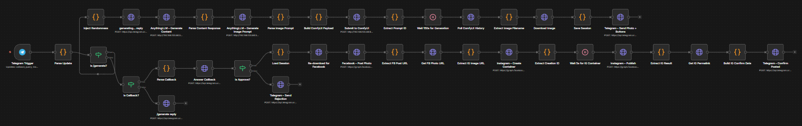

# Local-AI Social Media Factory (v5)



## Short Introduction

Local-AI Social Media Factory is a **zero-API-cost marketing automation system** that generates social media content using fully local AI models.

Instead of paying recurring cloud API fees, this system runs entirely on local hardware using:

- Local LLMs for copywriting  
- Local image generation models  
- Workflow automation tools  
- Human approval systems before publishing  

The project was built to solve a real business problem:

**Small businesses and marketing teams often cannot afford expensive AI subscriptions.**

This system reduces recurring operational expenses by replacing cloud APIs with local infrastructure.

**Core Philosophy:**  
*Own the infrastructure. Reduce recurring costs. Scale content production.*

---

## Project Goal

Create an automated content pipeline that can:

- Generate social media captions  
- Generate marketing images  
- Send content for approval  
- Publish content automatically  

while maintaining:

- Lower operational costs  
- Better privacy  
- More customization  
- Higher scalability  

---

## Technologies Used

### AI Copywriting
- Llama 3.1 (8B Q8)
- AnythingLLM API
- Local inference setup

---

### AI Image Generation
- ComfyUI
- Z Image Turbo
- Stable Diffusion XL models

---

### Workflow Automation
- n8n
- Docker
- Docker Compose

---

### Communication Layer
- Telegram Bot API

---

### Backend Utilities
- JavaScript
- JSON workflow configuration

---

## Features

### AI Caption Generation
Automatically generates:

- Social media posts  
- Marketing captions  
- Promotional content  

using local Llama models.

---

### AI Image Generation
Creates marketing visuals using:

- Stable Diffusion workflows  
- Custom prompts  
- Brand-specific visuals  

---

### Human-in-the-Loop Approval
Before publishing:

- Telegram sends draft content  
- User reviews content  
- One-tap approval system  

This reduces automation risks.

---

### Automatic Publishing
Can publish directly to:

- Facebook  
- Instagram  

through connected APIs.

---

### Cost Optimization
This system avoids:

- OpenAI API costs  
- Midjourney costs  
- SaaS automation costs  

This improves long-term ROI.

---

## Hardware Requirements

### Minimum
- RTX 3060 (12GB VRAM)
- 16GB RAM
- 20GB Storage

---

### Recommended
- RTX 4070+
- 32GB RAM
- Fast NVMe SSD

---

## Development Process (How It Was Built and Why)

---

### Why I Built It

Most AI automation businesses fail because recurring API costs destroy profit margins.

Example:

- OpenAI API costs scale with usage  
- Image APIs charge per generation  
- Automation tools charge monthly subscriptions  

For agencies handling many clients, these costs compound quickly.

I built this system using an economic strategy:

**High upfront hardware cost → lower long-term operational cost**

This follows SaaS margin optimization principles.

---

### Step 1: Identifying Bottlenecks

Manual workflow problems:

- Writing captions manually  
- Designing graphics manually  
- Publishing manually  
- Managing approvals manually  

These tasks consume time.

---

### Step 2: Replacing Manual Work

I automated:

Content writing → LLMs  
Image creation → Stable Diffusion  
Publishing → n8n  
Approval → Telegram

---

### Step 3: Building Safeguards

Fully automated posting can create legal and branding risks.

To reduce this:

- Human approval layer added  
- Compliance-focused prompts created  
- Output filtering implemented  

---

### Step 4: Deployment Optimization

Used Docker because it improves:

- Portability  
- Reproducibility  
- Easier deployment  
- Environment consistency  

---

## The "Mara" Prompt System

This project includes a custom marketing persona called **Mara**.

Mara improves output quality using:

### Sensory Hooks
Improves engagement by grabbing attention quickly.

---

### Compliance Messaging
References:

- BIR
- SSS
- PhilHealth

This increases trust in local markets.

---

### Visual Consistency
Prevents generic AI-generated visuals.

---

### No AI Fluff
Removes robotic-sounding content.

---

## What I Learned

### AI Infrastructure
- Local LLM deployment  
- Stable Diffusion workflows  
- GPU optimization  

---

### Automation Engineering
- n8n orchestration  
- API integrations  
- Workflow scaling  

---

### Business Strategy
- Cost reduction models  
- Automation ROI  
- Agency scaling economics  

---

### Risk Management
- Human approval systems  
- Compliance considerations  
- Platform restrictions  

---

## Troubleshooting

### Docker Connection Issues
Use:

```bash
host.docker.internal
```

instead of localhost.

---

### Telegram Issues
Use:

- Ngrok
- Cloudflare Tunnel

for webhook support.

---

### GPU Memory Problems
Solutions:

- Lower model precision  
- Use smaller models  
- Offload workloads to RAM  

---

### Output Cleanup Issues
Use:

```bash
scripts/parse-utils.js
```

to remove unwanted AI responses.

---

## How to Improve It

### Short-Term
- Better UI dashboard  
- More social platform integrations  
- Better analytics tracking  

---

### Medium-Term
- Multi-client support  
- CRM integration  
- Content scheduling dashboard  

---

### Long-Term
- SaaS product version  
- White-label agency platform  
- Multi-language support  

---

## How to Run the Project

### Clone Repository
```bash
git clone https://github.com/jerohalili/Content-Creation-AI-Automation.git
```

### Enter Directory
```bash
cd Content-Creation-AI-Automation
```

---

### Start Docker Services
```bash
docker-compose up -d
```

---

### Run ComfyUI
```bash
python main.py --listen
```

---

### Open n8n
```bash
http://localhost:5678
```

Import:

```bash
workflows/content-generator-v5.json
```

---

## Project Structure

```bash
workflows/
prompts/
scripts/
docker/
README.md
```

---

## Creator

**Jerohalili**

- GitHub: https://github.com/jerohalili  
- LinkedIn: www.linkedin.com/in/jero-halili-bb385b295  
- Email: jerobusiness20@gmail.com  

---

## License

MIT License
